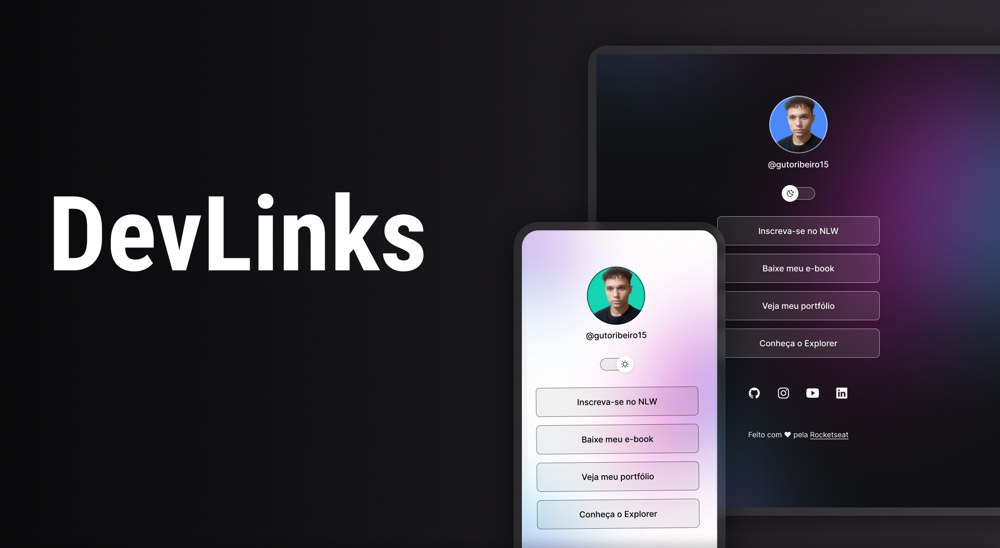

# DevLinks
 

    

## Tecnologias 

Esse projeto foi desenvolvido com as seguintes tecnologias:

-HTML e CSS  
-JavaScript 
-GitHub e Github Desktop

## Projeto ☻

O DevLinks é um agregador de links para usar como cartão de visitas online.